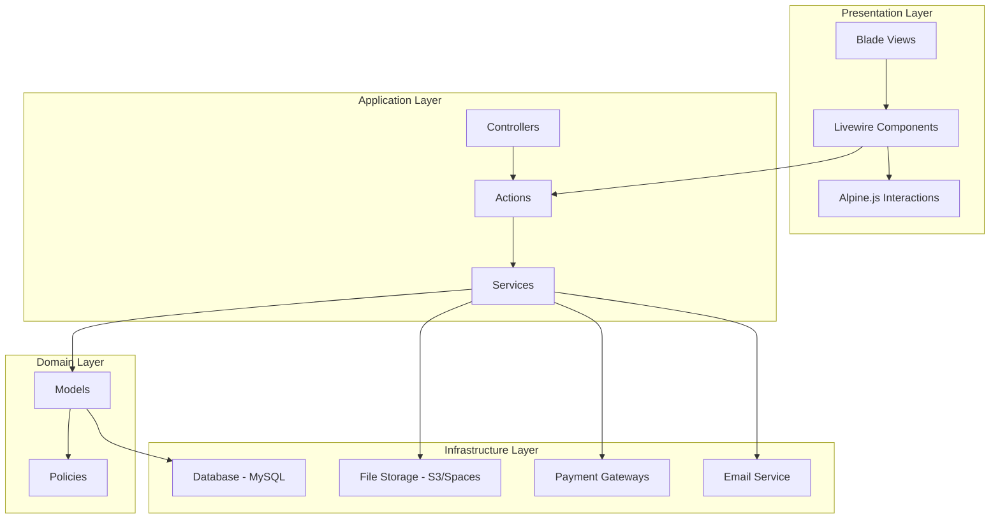

# Design Document

## Overview

The Digital Marketplace is a Laravel 11-based e-commerce platform for digital products, leveraging Livewire 3 for reactive components, Tailwind CSS for styling, and Alpine.js for lightweight JavaScript interactions. The system follows a three-tier architecture with clear separation between presentation (Livewire components and Blade views), business logic (Controllers, Actions, Services), and data persistence (Eloquent models and repositories).

The platform supports three distinct user roles (Customer, Seller, Admin) with role-specific dashboards and capabilities. Payment processing is handled through Stripe and Paytm integrations, while digital assets are securely stored in AWS S3 or DigitalOcean Spaces with time-limited signed URLs for downloads.

## Architecture

### High-Level Architecture



### Technology Stack

- **Framework**: Laravel 11 (latest stable)
- **Frontend**: Livewire 3, Tailwind CSS, Alpine.js
- **Authentication**: Laravel Fortify
- **Database**: MySQL 8.0+
- **File Storage**: AWS S3 or DigitalOcean Spaces
- **Payment Gateways**: Stripe, Paytm
- **Queue System**: Laravel Queue (database driver for development, Redis for production)
- **Cache**: Redis (production) / File (development)
- **Email**: Laravel Mail with configurable drivers

### Directory Structure

```
app/
├── Actions/              # Single-purpose action classes
│   ├── Cart/
│   ├── Payment/
│   ├── Product/
│   └── User/
├── Http/
│   ├── Controllers/      # Traditional controllers for web routes
│   ├── Requests/         # Form request validation classes
│   └── Middleware/       # Custom middleware
├── Livewire/            # Livewire components
│   ├── Cart/
│   ├── Product/
│   ├── Dashboard/
│   ├── Admin/
│   └── Notifications/
├── Models/              # Eloquent models
├── Notifications/       # Laravel notification classes
├── Policies/            # Authorization policies
├── Providers/           # Service providers
├── Services/            # Business logic services
│   ├── PaymentService.php
│   ├── StorageService.php
│   └── NotificationService.php
├── Events/              # Event classes
└── Listeners/           # Event listeners

resources/
├── views/
│   ├── layouts/         # Base layouts
│   ├── components/      # Blade components
│   ├── livewire/        # Livewire component views
│   ├── pages/           # Static pages
│   ├── dashboard/       # Dashboard views
│   └── errors/          # Error pages
├── css/
│   └── app.css          # Tailwind CSS
└── js/
    └── app.js           # Alpine.js and utilities

database/
├── migrations/          # Database migrations
├── seeders/            # Database seeders
└── factories/          # Model factories
```

## Components and Interfaces

### 1. Authentication System

**Components:**
- Laravel Fortify for authentication scaffolding
- Custom registration with role selection
- Email verification
- Password reset functionality

**Key Classes:**
- `App\Models\User` - User model with role management
- `App\Http\Middleware\RoleMiddleware` - Role-based access control
- `App\Policies\UserPolicy` - User authorization policy

**Role Implementation:**
```php
// User model
enum UserRole: string {
    case CUSTOMER = 'customer';
    case SELLER = 'seller';
    case ADMIN = 'admin';
}

class User extends Authenticatable
{
    protected $fillable = [
        'name', 'email', 'password', 'role', 
        'balance', 'is_banned', 'email_verified_at'
    ];
    
    protected $casts = [
        'role' => UserRole::class,
        'balance' => 'decimal:2',
        'is_banned' => 'boolean',
        'email_verified_at' => 'datetime',
    ];
    
    public function isAdmin(): bool
    {
        return $this->role === UserRole::ADMIN;
    }
    
    public function isSeller(): bool
    {
        return $this->role === UserRole::SELLER;
    }
    
    public function isCustomer(): bool
    {
        return $this->role === UserRole::CUSTOMER;
    }
}

// Middleware checks
public function handle($request, Closure $next, ...$roles)
{
    if (!$request->user() || !in_array($request->user()->role, $roles)) {
        abort(403);
    }
    
    // Check if user is banned
    if ($request->user()->is_banned) {
        Auth::logout();
        abort(403, 'Your account has been banned.');
    }
    
    return $next($request);
}
```

**Seller Role Request Workflow:**
1. User registers as Customer (default role)
2. Customer requests to become a Seller via profile settings
3. Request creates a notification for admins
4. Admin reviews request and approves/rejects
5. Upon approval, user role is updated to Seller
6. Seller receives notification and gains access to seller features

**Design Rationale:** Starting all users as Customers and requiring admin approval for Seller status ensures quality control and prevents spam. This workflow allows the platform to vet sellers before they can list products, maintaining marketplace integrity.

### 2. Product Management System

**Livewire Components:**
- `ProductSearch` - Real-time search with filters
- `ProductCard` - Reusable product display component
- `ProductUpload` - File upload with progress tracking
- `ProductList` - Infinite scroll product listing
- `ProductDetail` - Product detail page with preview

**Models:**
- `Product` - Main product model
- `Category` - Product categories
- `ProductType` - Asset types (audio, video, 3D, template, graphic)

**Key Features:**
- Slug generation for SEO-friendly URLs
- Soft deletes for product removal
- Approval workflow (pending → approved → published)
- File upload with chunking for large files
- Thumbnail generation and optimization

**Product Model Structure:**
```php
class Product extends Model
{
    protected $fillable = [
        'user_id', 'title', 'slug', 'description', 
        'short_description', 'category_id', 'product_type',
        'price', 'license_type', 'thumbnail_path', 
        'file_path', 'file_size', 'is_approved', 
        'is_active', 'rejection_reason', 'downloads_count'
    ];
    
    protected $casts = [
        'price' => 'decimal:2',
        'is_approved' => 'boolean',
        'is_active' => 'boolean',
    ];
}
```

### 3. Shopping Cart System

**Livewire Components:**
- `CartIcon` - Header cart icon with item count
- `CartPage` - Full cart management interface
- `CartItem` - Individual cart item component

**Implementation:**
- Session-based cart for guests
- Database-backed cart for authenticated users
- Cart persistence across sessions
- Automatic cart merging on login

**Cart Service:**
```php
class CartService
{
    public function add(Product $product, int $quantity = 1): void
    public function remove(int $productId): void
    public function update(int $productId, int $quantity): void
    public function clear(): void
    public function getItems(): Collection
    public function getTotal(): float
    public function getCount(): int
}
```

### 4. Payment Processing System

**Payment Service Architecture:**
```php
interface PaymentGatewayInterface
{
    public function createPaymentIntent(float $amount, array $metadata): array;
    public function confirmPayment(string $paymentId): bool;
    public function refund(string $paymentId, float $amount): bool;
}

class StripePaymentGateway implements PaymentGatewayInterface { }
class PaytmPaymentGateway implements PaymentGatewayInterface { }
```

**Livewire Components:**
- `CheckoutForm` - Payment form with gateway selection
- `PaymentStatus` - Payment confirmation page

**Payment Flow:**
1. Customer proceeds to checkout
2. System creates transaction record (status: pending)
3. Payment gateway processes payment
4. Webhook confirms payment success
5. System updates transaction (status: completed)
6. Generate download links
7. Send confirmation email
8. Dispatch PurchaseCompleted event

**Transaction Model:**
```php
class Transaction extends Model
{
    protected $fillable = [
        'user_id', 'payment_gateway', 'payment_id',
        'amount', 'commission', 'seller_amount',
        'status', 'metadata'
    ];
    
    protected $casts = [
        'amount' => 'decimal:2',
        'commission' => 'decimal:2',
        'seller_amount' => 'decimal:2',
        'metadata' => 'array',
    ];
}
```

### 5. Digital Asset Delivery System

**Storage Service:**
```php
class StorageService
{
    public function uploadFile(UploadedFile $file, string $path): string
    public function deleteFile(string $path): bool
    public function generateTemporaryUrl(string $path, int $hours): string
    public function getFileSize(string $path): int
}
```

**Download Management:**
- Signed URLs with configurable expiration (default: 24 hours)
- Rate limiting: 10 downloads per hour per user
- Download tracking for analytics
- Automatic URL regeneration for expired links

**Download Model:**
```php
class Download extends Model
{
    protected $fillable = [
        'user_id', 'product_id', 'transaction_id',
        'download_url', 'expires_at', 'downloaded_at'
    ];
    
    protected $casts = [
        'expires_at' => 'datetime',
        'downloaded_at' => 'datetime',
    ];
}
```

### 6. Seller Dashboard

**Livewire Components:**
- `SellerDashboard` - Overview with stats
- `SellerProducts` - Product management table
- `SellerAnalytics` - Sales charts and metrics
- `WithdrawalRequest` - Payout request form

**Analytics Metrics:**
- Total revenue (with commission deduction)
- Total downloads
- Top-performing products
- Revenue trends (daily, weekly, monthly)
- Pending balance
- Completed withdrawals

**Withdrawal System:**
```php
class Withdrawal extends Model
{
    protected $fillable = [
        'user_id', 'amount', 'method', 'account_details',
        'status', 'admin_notes', 'processed_at'
    ];
    
    protected $casts = [
        'amount' => 'decimal:2',
        'account_details' => 'encrypted:array',
        'processed_at' => 'datetime',
    ];
}
```

### 7. Admin Dashboard

**Livewire Components:**
- `AdminDashboard` - Platform-wide analytics
- `UserManagement` - User list with role management and seller approvals
- `ProductModeration` - Pending product approvals with rejection reasons
- `TransactionList` - All transactions
- `WithdrawalManagement` - Payout approvals

**Admin Analytics:**
- Total platform revenue
- Commission earned
- Total transactions
- Active users by role
- Top sellers
- Top products
- Revenue trends with charts

**User Management Features:**
- View all registered users with filtering by role
- Approve seller role requests (users can request to become sellers)
- Ban/unban user accounts
- Modify user roles (promote/demote)
- View user activity and transaction history

**Design Rationale:** Seller role approval workflow ensures quality control by allowing admins to vet sellers before they can list products. This prevents spam and maintains marketplace integrity.

**Product Moderation Features:**
- View pending products with full details
- Approve products to make them publicly visible
- Reject products with mandatory rejection reason
- Edit product details before approval
- Delete products that violate policies
- View product approval history

**Design Rationale:** Rejection reasons provide transparency and help sellers understand why their products were not approved, enabling them to make necessary corrections and resubmit.

### 8. Customer Dashboard

**Livewire Components:**
- `PurchaseHistory` - List of purchased products
- `ProfileSettings` - Account management
- `BillingHistory` - Transaction history with invoices

**Features:**
- Re-download purchased products
- Generate new download links
- Download PDF invoices
- Update profile information
- Change password with current password verification
- Update email address with verification

**Design Rationale:** Email verification on email changes prevents account hijacking, while current password verification for password changes adds an extra security layer.

### 9. Notification System

**Components:**
- `App\Services\NotificationService` - Centralized notification handling
- `App\Notifications\*` - Laravel notification classes
- `App\Events\*` - Event classes that trigger notifications

**Notification Channels:**
- Email notifications via Laravel Mail
- In-app notifications stored in database
- Real-time notifications via Livewire events (optional: Laravel Echo with Pusher)

**Livewire Components:**
- `NotificationBell` - Header notification icon with unread count
- `NotificationDropdown` - Dropdown list of recent notifications
- `NotificationCenter` - Full notification history page

**Notification Types:**

**Customer Notifications:**
- Purchase confirmation with download links (email + in-app)
- Download link expiration reminder (email)
- New product from followed sellers (in-app, future enhancement)

**Seller Notifications:**
- New sale notification (email + in-app)
- Product approval (email + in-app)
- Product rejection with reason (email + in-app)
- Withdrawal request approved (email + in-app)
- Withdrawal request rejected with reason (email + in-app)

**Admin Notifications:**
- New product pending approval (in-app)
- New withdrawal request (in-app)
- New seller role request (in-app)

**Notification Model:**
```php
// Using Laravel's built-in notifications table
Schema::create('notifications', function (Blueprint $table) {
    $table->uuid('id')->primary();
    $table->string('type');
    $table->morphs('notifiable');
    $table->text('data');
    $table->timestamp('read_at')->nullable();
    $table->timestamps();
});
```

**Design Rationale:** Dual-channel notifications (email + in-app) ensure users receive critical updates even when not actively using the platform, while in-app notifications provide a seamless experience for active users. The notification system uses Laravel's built-in notification infrastructure for consistency and maintainability.

## Data Models

### Entity Relationship Diagram

```mermaid
erDiagram
    USERS ||--o{ PRODUCTS : creates
    USERS ||--o{ TRANSACTIONS : makes
    USERS ||--o{ CARTS : has
    USERS ||--o{ DOWNLOADS : receives
    USERS ||--o{ WITHDRAWALS : requests
    USERS ||--o{ NOTIFICATIONS : receives
    PRODUCTS ||--o{ TRANSACTIONS : "sold in"
    PRODUCTS ||--o{ CARTS : "added to"
    PRODUCTS ||--o{ DOWNLOADS : "downloaded as"
    PRODUCTS }o--|| CATEGORIES : "belongs to"
    TRANSACTIONS ||--o{ TRANSACTION_ITEMS : contains
    TRANSACTION_ITEMS }o--|| PRODUCTS : references
    
    USERS {
        bigint id PK
        string name
        string email UK
        string password
        enum role
        decimal balance
        boolean is_banned
        timestamp email_verified_at
        timestamps
    }
    
    PRODUCTS {
        bigint id PK
        bigint user_id FK
        bigint category_id FK
        string title
        string slug UK
        text description
        text short_description
        enum product_type
        decimal price
        string license_type
        string thumbnail_path
        string file_path
        bigint file_size
        boolean is_approved
        boolean is_active
        text rejection_reason
        integer downloads_count
        timestamps
        softDeletes
    }
    
    CATEGORIES {
        bigint id PK
        string name
        string slug UK
        text description
        string icon
        integer order
        timestamps
    }
    
    TRANSACTIONS {
        bigint id PK
        bigint user_id FK
        string payment_gateway
        string payment_id UK
        decimal amount
        decimal commission
        decimal seller_amount
        enum status
        json metadata
        timestamps
    }
    
    TRANSACTION_ITEMS {
        bigint id PK
        bigint transaction_id FK
        bigint product_id FK
        bigint seller_id FK
        decimal price
        decimal commission
        decimal seller_amount
        timestamps
    }
    
    CARTS {
        bigint id PK
        bigint user_id FK
        string session_id
        bigint product_id FK
        integer quantity
        timestamps
    }
    
    DOWNLOADS {
        bigint id PK
        bigint user_id FK
        bigint product_id FK
        bigint transaction_id FK
        text download_url
        timestamp expires_at
        timestamp downloaded_at
        timestamps
    }
    
    WITHDRAWALS {
        bigint id PK
        bigint user_id FK
        decimal amount
        enum method
        json account_details
        enum status
        text admin_notes
        timestamp processed_at
        timestamps
    }
    
    NOTIFICATIONS {
        uuid id PK
        string type
        bigint notifiable_id FK
        string notifiable_type
        text data
        timestamp read_at
        timestamps
    }
```

### Database Indexes

**Performance Optimization:**
```sql
-- Users table
INDEX idx_users_role (role)
INDEX idx_users_email (email)
INDEX idx_users_is_banned (is_banned)

-- Products table
INDEX idx_products_user_id (user_id)
INDEX idx_products_category_id (category_id)
INDEX idx_products_slug (slug)
INDEX idx_products_is_approved_is_active (is_approved, is_active)
INDEX idx_products_created_at (created_at)

-- Transactions table
INDEX idx_transactions_user_id (user_id)
INDEX idx_transactions_payment_id (payment_id)
INDEX idx_transactions_status (status)
INDEX idx_transactions_created_at (created_at)

-- Transaction Items table
INDEX idx_transaction_items_transaction_id (transaction_id)
INDEX idx_transaction_items_product_id (product_id)
INDEX idx_transaction_items_seller_id (seller_id)

-- Downloads table
INDEX idx_downloads_user_id (user_id)
INDEX idx_downloads_product_id (product_id)
INDEX idx_downloads_expires_at (expires_at)

-- Carts table
INDEX idx_carts_user_id (user_id)
INDEX idx_carts_session_id (session_id)

-- Notifications table
INDEX idx_notifications_notifiable (notifiable_type, notifiable_id)
INDEX idx_notifications_read_at (read_at)

-- Withdrawals table
INDEX idx_withdrawals_user_id (user_id)
INDEX idx_withdrawals_status (status)
```

## Error Handling

### Exception Handling Strategy

**Custom Exceptions:**
```php
// Payment exceptions
class PaymentFailedException extends Exception { }
class PaymentGatewayException extends Exception { }

// Product exceptions
class ProductNotFoundException extends Exception { }
class ProductNotApprovedException extends Exception { }
class InsufficientBalanceException extends Exception { }

// Download exceptions
class DownloadLinkExpiredException extends Exception { }
class DownloadLimitExceededException extends Exception { }
```

**Global Exception Handler:**
- Log all exceptions to Laravel log
- Return JSON for API requests
- Render user-friendly error pages for web requests
- Send critical errors to monitoring service (optional: Sentry, Bugsnag)

**Validation:**
- Use Form Request classes for all input validation
- Return validation errors with field-specific messages
- Livewire real-time validation for better UX

**User Feedback:**
- Success messages displayed via Livewire flash messages
- Toast notifications for non-blocking feedback
- Inline validation errors for form fields
- Loading states for async operations
- Confirmation dialogs for destructive actions

**Error Pages:**
- `resources/views/errors/404.blade.php` - Not Found
- `resources/views/errors/403.blade.php` - Forbidden
- `resources/views/errors/419.blade.php` - Session Expired
- `resources/views/errors/500.blade.php` - Server Error
- `resources/views/errors/503.blade.php` - Maintenance Mode

**Design Rationale:** Clear, contextual feedback helps users understand system state and recover from errors quickly. Toast notifications provide non-intrusive feedback while allowing users to continue their workflow.

## Testing Strategy

### Test Coverage

**Unit Tests:**
- Model methods and relationships
- Service class methods
- Action class logic
- Helper functions
- Payment gateway integrations (mocked)

**Feature Tests:**
- Authentication flows
- Product CRUD operations
- Cart management
- Checkout process
- Download link generation
- Admin operations
- API endpoints

**Livewire Component Tests:**
- Component rendering
- User interactions
- Data binding
- Event emissions
- Authorization checks

**Browser Tests (Dusk):**
- Complete purchase flow
- Product upload workflow
- Admin approval process
- Seller withdrawal request

### Testing Tools

- **PHPUnit**: Unit and feature tests
- **Pest**: Alternative testing framework (optional)
- **Laravel Dusk**: Browser automation tests
- **Livewire Testing**: Component-specific tests

### Test Database

- Use SQLite in-memory database for faster tests
- Database transactions for test isolation
- Factory classes for test data generation
- Seeders for consistent test scenarios

## Security Considerations

### Authentication & Authorization

- **Password Hashing**: Bcrypt with cost factor 10
- **Session Management**: Secure, HTTP-only cookies
- **CSRF Protection**: Laravel's built-in CSRF middleware
- **Rate Limiting**: Throttle login attempts, API requests, downloads
- **Two-Factor Authentication**: Optional future enhancement

### File Security

- **Private Storage**: All digital assets stored with private ACL
- **Signed URLs**: Time-limited, cryptographically signed download links
- **File Validation**: Validate file types, sizes, and MIME types
- **Virus Scanning**: Optional integration with ClamAV or cloud service

### Payment Security

- **PCI Compliance**: Never store credit card details
- **Webhook Verification**: Verify webhook signatures from payment gateways
- **Idempotency**: Prevent duplicate payment processing
- **Secure Credentials**: Store API keys in environment variables

### Data Protection

- **Encryption**: Encrypt sensitive data (withdrawal account details)
- **SQL Injection**: Use Eloquent ORM and parameterized queries
- **XSS Protection**: Blade template escaping by default
- **Input Validation**: Validate and sanitize all user inputs
- **HTTPS**: Enforce HTTPS in production

### Authorization Policies

```php
// ProductPolicy
public function update(User $user, Product $product): bool
{
    return $user->id === $product->user_id || $user->isAdmin();
}

public function delete(User $user, Product $product): bool
{
    return $user->id === $product->user_id || $user->isAdmin();
}

// TransactionPolicy
public function view(User $user, Transaction $transaction): bool
{
    return $user->id === $transaction->user_id || $user->isAdmin();
}
```

## Performance Optimization

### Caching Strategy

- **Query Caching**: Cache expensive database queries (categories, featured products)
- **View Caching**: Cache rendered Blade views in production
- **Route Caching**: Cache route definitions
- **Config Caching**: Cache configuration files
- **CDN**: Serve static assets via CDN

### Database Optimization

- **Eager Loading**: Prevent N+1 queries with `with()` and `load()`
- **Pagination**: Use cursor pagination for large datasets
- **Indexes**: Strategic indexes on frequently queried columns
- **Query Optimization**: Use `select()` to limit retrieved columns

### File Storage Optimization

- **Lazy Loading**: Load images on scroll
- **Image Optimization**: Compress thumbnails
- **CDN Integration**: Serve files via CloudFront or CDN
- **Chunked Uploads**: Handle large file uploads in chunks

### Queue System

**Queued Jobs:**
- Email notifications
- File processing (thumbnail generation)
- Analytics calculations
- Webhook processing
- Invoice generation

**Queue Configuration:**
- Development: Database driver
- Production: Redis driver with Horizon for monitoring

## Responsive Design and Accessibility

### Responsive Design Strategy

**Mobile-First Approach:**
- Design for mobile screens (320px) first, then progressively enhance for larger screens
- Use Tailwind CSS responsive utilities (sm:, md:, lg:, xl:, 2xl:)
- Implement touch-friendly UI elements (minimum 44x44px tap targets)
- Optimize images with responsive srcset attributes

**Breakpoints:**
```css
/* Tailwind CSS default breakpoints */
sm: 640px   /* Small tablets and large phones */
md: 768px   /* Tablets */
lg: 1024px  /* Laptops and small desktops */
xl: 1280px  /* Desktops */
2xl: 1536px /* Large desktops */
```

**Responsive Components:**
- Navigation: Hamburger menu on mobile, full navigation on desktop
- Product grid: 1 column (mobile) → 2 columns (tablet) → 3-4 columns (desktop)
- Dashboard: Stacked cards (mobile) → Grid layout (desktop)
- Forms: Full-width inputs (mobile) → Multi-column layouts (desktop)

**Design Rationale:** Mobile-first design ensures the core experience works on all devices, with progressive enhancement for larger screens. This approach prioritizes the growing mobile user base while maintaining desktop functionality.

### Dark Mode Support

**Implementation:**
- Use Tailwind CSS dark mode with class strategy
- Store user preference in local storage
- Provide toggle switch in header/settings
- Apply dark mode classes to all components

**Color Scheme:**
```css
/* Light mode (default) */
--bg-primary: #ffffff
--bg-secondary: #f3f4f6
--text-primary: #111827
--text-secondary: #6b7280

/* Dark mode */
dark:--bg-primary: #1f2937
dark:--bg-secondary: #111827
dark:--text-primary: #f9fafb
dark:--text-secondary: #d1d5db
```

**Design Rationale:** Dark mode reduces eye strain in low-light environments and is increasingly expected by users. The class-based strategy allows for user preference persistence and easy toggling.

### Accessibility Features

**Semantic HTML:**
- Use proper heading hierarchy (h1 → h2 → h3)
- Semantic elements: `<nav>`, `<main>`, `<article>`, `<aside>`, `<footer>`
- Form labels properly associated with inputs
- Button elements for interactive actions (not divs)

**ARIA Labels and Roles:**
```html
<!-- Navigation -->
<nav aria-label="Main navigation">
  <button aria-expanded="false" aria-controls="mobile-menu">Menu</button>
</nav>

<!-- Product cards -->
<article role="article" aria-labelledby="product-title-123">
  <h3 id="product-title-123">Product Name</h3>
</article>

<!-- Notifications -->
<div role="alert" aria-live="polite">Success message</div>

<!-- Loading states -->
<div role="status" aria-live="polite" aria-busy="true">Loading...</div>
```

**Keyboard Navigation:**
- All interactive elements accessible via Tab key
- Skip to main content link for screen readers
- Focus indicators visible on all focusable elements
- Escape key closes modals and dropdowns
- Arrow keys for dropdown navigation

**Screen Reader Support:**
- Alt text for all images
- aria-label for icon-only buttons
- aria-describedby for form field hints
- Visually hidden text for context (e.g., "Loading products")
- Announce dynamic content changes with aria-live

**Color Contrast:**
- WCAG AA compliance (4.5:1 for normal text, 3:1 for large text)
- Test with tools like axe DevTools or Lighthouse
- Avoid color-only indicators (use icons + color)

**Focus Management:**
- Visible focus indicators (outline or ring)
- Focus trap in modals
- Return focus to trigger element when closing modals
- Logical tab order

**Design Rationale:** Accessibility is not just a legal requirement but ensures the platform is usable by everyone, including users with disabilities. Proper semantic HTML and ARIA labels improve screen reader experience, while keyboard navigation ensures users who cannot use a mouse can still navigate effectively.

## API Design

### REST API Endpoints

**Public Endpoints:**
```
GET    /api/products              - List products with filters
GET    /api/products/{slug}       - Get product details
GET    /api/categories            - List categories
```

**Authenticated Endpoints:**
```
GET    /api/user/purchases        - User's purchased products
POST   /api/user/downloads/{id}   - Generate download link
```

**Rate Limiting:**
- Public API: 60 requests per minute
- Authenticated API: 120 requests per minute
- Download generation: 10 requests per hour

**Response Format:**
```json
{
    "success": true,
    "data": { },
    "message": "Success message",
    "meta": {
        "current_page": 1,
        "total": 100
    }
}
```

## Deployment Considerations

### Environment Configuration

**Required Environment Variables:**
```env
APP_ENV=production
APP_DEBUG=false
APP_URL=https://marketplace.example.com

DB_CONNECTION=mysql
DB_HOST=127.0.0.1
DB_DATABASE=marketplace
DB_USERNAME=root
DB_PASSWORD=

FILESYSTEM_DISK=s3
AWS_ACCESS_KEY_ID=
AWS_SECRET_ACCESS_KEY=
AWS_DEFAULT_REGION=us-east-1
AWS_BUCKET=

STRIPE_KEY=
STRIPE_SECRET=
STRIPE_WEBHOOK_SECRET=

PAYTM_MERCHANT_ID=
PAYTM_MERCHANT_KEY=
PAYTM_WEBSITE=
PAYTM_ENVIRONMENT=production

MAIL_MAILER=smtp
MAIL_HOST=
MAIL_PORT=587
MAIL_USERNAME=
MAIL_PASSWORD=

QUEUE_CONNECTION=redis
REDIS_HOST=127.0.0.1
REDIS_PASSWORD=null
REDIS_PORT=6379

DOWNLOAD_LINK_EXPIRY_HOURS=24
PLATFORM_COMMISSION_PERCENT=10
```

### Deployment Checklist

1. Run migrations: `php artisan migrate --force`
2. Cache configuration: `php artisan config:cache`
3. Cache routes: `php artisan route:cache`
4. Cache views: `php artisan view:cache`
5. Optimize autoloader: `composer install --optimize-autoloader --no-dev`
6. Build assets: `npm run build`
7. Set up queue workers: `php artisan queue:work --daemon`
8. Set up scheduled tasks: Add cron job for `php artisan schedule:run`
9. Configure SSL certificate
10. Set up monitoring and logging

### Scaling Considerations

- **Horizontal Scaling**: Load balancer with multiple app servers
- **Database**: Read replicas for heavy read operations
- **File Storage**: CDN for global asset delivery
- **Queue Workers**: Multiple queue workers for job processing
- **Cache**: Redis cluster for distributed caching
- **Session Storage**: Redis for shared session storage

## Future Enhancements

- **Subscription Plans**: Monthly/yearly access to product libraries
- **Product Bundles**: Sell multiple products as a package
- **Affiliate System**: Referral commissions for affiliates
- **Product Reviews**: Customer ratings and reviews
- **Wishlist**: Save products for later
- **Social Login**: OAuth with Google, Facebook, GitHub
- **Advanced Analytics**: Detailed seller and admin dashboards
- **Multi-currency**: Support for multiple currencies
- **Multi-language**: Internationalization support
- **Live Chat**: Customer support integration
- **Product Licensing**: Advanced license management
- **API Marketplace**: Public API for third-party integrations
